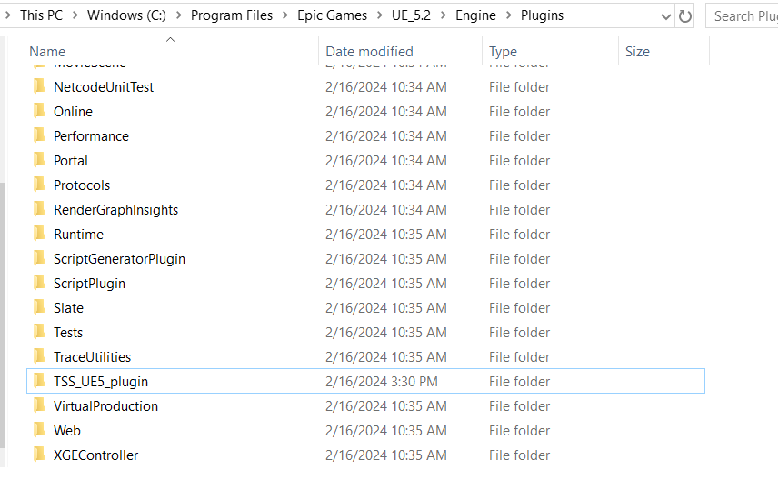
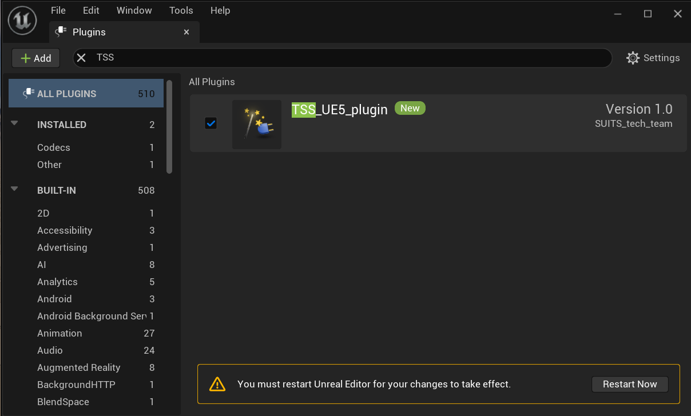
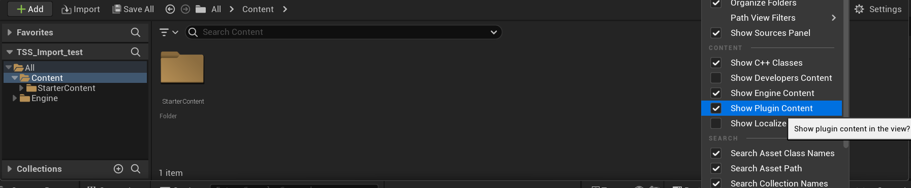
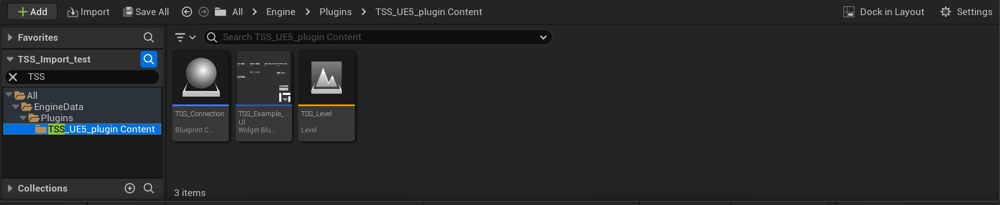

<h1 align="center">
  :man_astronaut: S.U.I.T.S. Unreal Engine 5 Package :woman_astronaut:
</h1>
<h4 align="center">
  :telescope: Unreal Plugin to Communicate with the SUITS TSS Server :rocket:
</h4>

---

<h5 align="center">
  <a href="https://microgravityuniversity.jsc.nasa.gov/nasasuits">NASA SUITS Website</a> •
  <a href="#earth_americas-for-suits-teams">For SUITS Teams</a> •
  <a href="#computer-for-nasa-team">For NASA Team</a>
</h5>

---
<br>

## :earth_americas: Setup Unreal Plugin
1. Download Unreal Engine 5.2 (The latest stable version). We have not fully tested other versions of Unreal.

2. Clone the repository...\
This repository contains the UE5 plugin and an example of how to use it.
```
git clone https://github.com/SUITS-Techteam/TSS_Unreal_Package_2024.git
```
3. Copy the entire `TSS_UE5_plugin` folder into the Plugin folder where you installed the Unreal Engine:
The Default location for the Plugin Folder is: C:\Program Files\Epic Games\UE_5.2\Engine\Plugins.


4. Create a new Unreal Engine Project. Since this is an AR Challenge, it might be beneficial to select the AR Starting project. However, the plugin will work with an empty project and no starter content.

5. Add the `TSS_UE5_plugin` Package to your project. 
    - Click the Edit/Plugins, on the top left of the screen
    - Search `TSS_UE5_plugin`. If you do not see it, make sure you copied it to the correct folder in step 3. 
    - Enable the plugin and restart the Unreal Engine.
    - 

6. Once the Unreal Engine relaunches, the Plugin should be successfully loaded. To Access the example: 
    - Click the content drawer in the bottom left of the main window. 
    - Click the Settings windows within the content drawer and select "Show Engine Content" and "Show Plugin Content". 
    
    - In the content drawer, navigate to EngineData/Plugins/TSS_UE5_plugin content
    
    - Double click `TSS_level` to open it and view the example. 

7. Run the TSS Server (directions at https://github.com/SUITS-Techteam/TSS_2024.git)

8. To run the scene, click the Play button at the top middle of the screen

9. Modify the IP address to the IP address of the server (Leave it as is, if you are using local host)

10. Click Connect to TSSc and you should see the data values update


11. Look at the TSS_example_UI and the TSS_Connection and learn how they interact. As long as the TSS_Connection actor is in your scene and setup properly (look at level blueprint for the example level) it can stream TSS data to your UI.